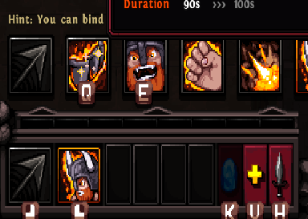

# Frequently Asked Questions
## General
### How do I change my loot filter?
> In the Options under Gameplay.

### How can I bind additional Skills?
> 1. Set your Skill keybinds in the control settings
> 1. Click on your second hot bar slot (the one with the right-click mouse icon) to show the available skills.
> 1. Hover over the skill
> 1. Press the desired hot key while hovering over the skill you want to bind in the skill selection bar shown above

### How do I equip charms?
> Move the charms into the golden area of the first inventory tab.

### Why is does the mail not find the recipient?
> The mail uses the account name as the recipient identifier, which is a **major security risk**. If possible, avoid the mail and trade in character.

### Is Magic Find required to drop certain items?
> No. More info over at [Magic Find].

### Where can I find the crafting recipes?
> Crafting recipes for Runewords, the Cube, Prospecting and Jewelcrafting can be found in the Journal menu ingame.

### What do angelic keys do?
> Angelic keys can be used to open the Angelic Realm in the Dawn's Chapel (6-0). The Angelic Realm will give you the option to add or upgrade (Body Armor) [Augments](https://docs.google.com/spreadsheets/d/1QWjl6lITbMkjptYPIRwnIVUs7JQkqfEqAILlCgp1zAM/edit#gid=700219462).

## Items
### How can I automatically move my potions into the potion slots?
> Go to your potion inventory on the bottom left of your inventory, and then enable the "Autofill belt" option below the glove equipment slot.

### What do the blue numbers on the item mean?
> A blue number on the Damage, Defense or Block Chance means that it has been increased by a stat on the item.

## Combat
### What's the best class?
> Please refer to the ingame "Solo Ranking" leaderboards, which are available in the online lobby. Check which class has the highest top 10 Wormhole rankings.

### What's the best build for my class?
> Have a look at the #class-discussion channel over at the [Hero Siege Discord](https://discord.com/invite/herosiegeofficial).

### Can [Spell Skills] crit? 
> No, only [Attack Skills] can crit.

### Can dot's crit? 
> No, only [Attack Skills] can crit.

### Why is my Skill Damage % not increasing the damage of my skill?
> [Attack Skills] do not benefit from the Skill Damage stat.

### Why is my life steal / mana steal not working?
> Life and Mana stolen per hit work only for your Physical Attack damage.

### Is Additive Damage affected by Resistances?
> Additive Arcane, Cold, Fire, Poison and Lightning Damage are affected by enemy Resistances. Additive Physical Damage is not affected by any Resistances, since there is no Physical Resistance.

### Is Physical Damage a type of Magic Damage?
> No. 

### What is Magic Damage?
> Magic Damage includes the following damage types: Arcane, Cold, Fire, Poison and Lightning Damage.

----

[Attack Skills]: ./guides/damage_for_beginners.html#attack-skill
[Spell Skills]: ./guides/damage_for_beginners.html#spell-skill
[Magic Find]: ./mechanics/stats.html#magic-find
