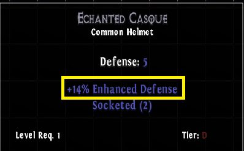
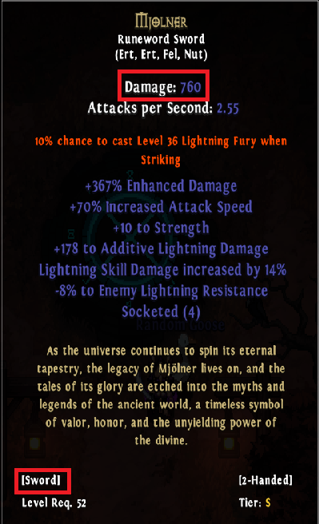
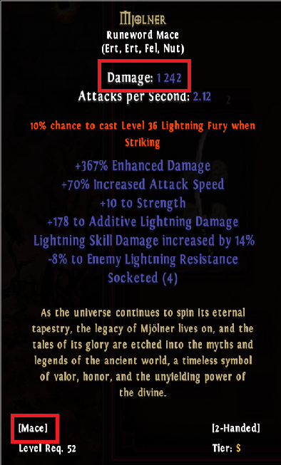

# Runewords
Runewords are created by socketing specific runes in a specific order into one of the supported base types. The base must be common and requires the exact amount of sockets. The Runeword page in the journal, which can be accessed by clicking the book icon in the ingame menu, lists all the Runeword recipes. The level requirement of the finished Runeword is taken from the highest level requirement of the used items (base and runes).

## Difference in bases
There is no tier requirement for the base and the tier won't affect the rolls but the stats will carry over from the base to the finished Runeword. This means that if the Runeword has "local" stats like [Enhanced Damage] and/or [Enhanced Defense], then it will change the Damage or Defense value of that item dramatically. The base will also affect the level required to use the item if it's higher than the level requirement of the runes.

### Example: Scholar - "D" tier base

The base (which has an Enhanced Defense affix):

The resulting Runeword:

Notice how the "+14% Enhanced Defense" affix was carried over from the base to the Runeword and how the level requirement changed from 1 to 27 due to the highest rune (Sal) having the level requirement of 27.

### Example: Scholar - "S" tier base
The base:

The resulting Runeword:

The level requirement was not changed, because the base already had one of level 52 and all the used runes were lower than that. The Defense is a lot higher in the S tier version, because the used based has a much higher Defense value to begin with.

### Example: Mjolner - 1h base
The base:

The resulting Runeword:

### Example: Mjolner - 2h base
The base:

The resulting Runeword:

Notice how much higher the Damage on the 2-Handed weapon is due to the high  Damage on the 2-Handed base, even though it rolled very similar stats (1h and 2h have the same item stat ranges).

### Example: Mjolner - Sword vs Mace
The weapon base can have a big impact on the result as well. See for example Mjolnir as Sword vs Mace:

