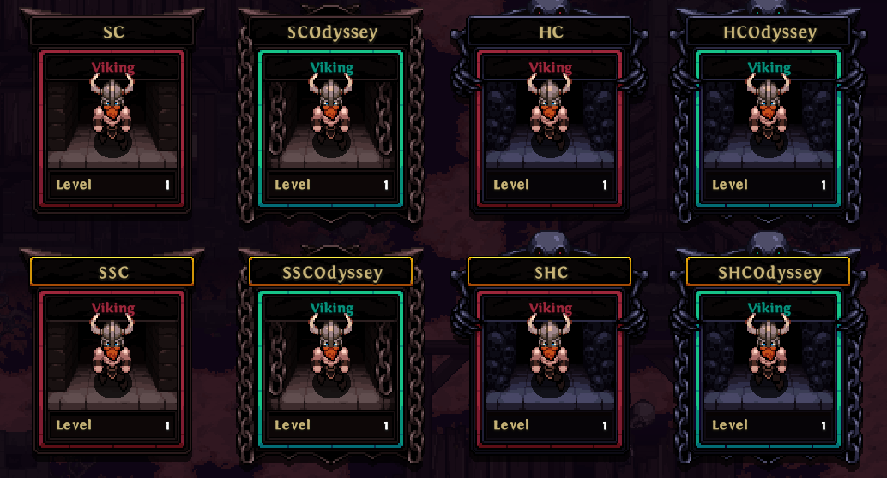

# Game Modes

There are three key decisions to make when creating a character:
1. Seasonal vs. Non-Seasonal
1. Hardcore vs. Softcore
1. Trade vs. Odyssey

More on that in the following chapters.

The choice is reflected in the portraits at the character selection screen.

## Seasonal vs. Non-Seasonal
Seasonal heroes start in a fresh temporary environment which typically lasts for 3 months. They can only play with other seasonal heroes. At the end of the season they are transferred to the non-seasonal environment.

The non-seasonal environment is permanent and does not reset with seasons. They can only play with other non-seasonal heroes.

## Hardcore vs. Softcore
Hardcore heroes only have a single life and won't be able to resurrect. They can only play with other Hardcore heroes. Be warned: dead Hardcore heroes will not be resurrected for any reason.

Softcore heroes can resurrect infinitely and can only play with other Softcore heroes.

## Odyssey vs. Trade
Odyssey is essentially solo-self found, meaning that Odyssey heroes can only play solo and are not able to use the market, the trade function or the mailbox. Odyssey heroes have an additional +300% [Magic Find](/stats.html#magic-find).

Trade is the default mode where you are able to freely group up and trade with other heroes.