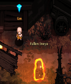
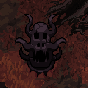
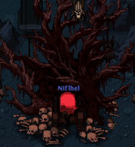

# Uber Bosses 
Uber bosses are the aspirational content in Hero Siege 2. They are level 200+ and require a well geared hero in order to defeat them. These bosses drop a guaranteed boss set item. If you die inside an uber boss dungeon, you won't be able to return and have to pay the entry fee again.

## Uber Damien
To summon Uber Damien, you need to brim "Um", in the "Town of Inoya" (Act 1), a "Key of Terror" and he will open  portal to Fallen Inoya. The "Key of Terror" can be crafted at the cube with the six Prime Evil Artifacts ("Gurag's Soul", "Death's Sigil", "Damien's Eye", "Anubis' Ankh", "Karp King's Bellybutton" and "Satan's Horn").

## Uber Reaper
Uber Reaper is found in the Shadow Realm. Shadow Realms are random spawns throughout zones on Hell Difficulty. You need 10 "Dimensional Shards" to enter the Reaper's Breach.

## War God Sung Lee
War God Sung Lee is found in the Eternal Battlefields. It can be accessed by bringing 50 "Battle Fragments" to the Eternal Battlefields portal, which can spawn randomly throughout zones on Hell difficulty.

## Sheep King
Sheep King is found in Sheeponia. To open the portal, bring a Cloud Key to the dragon head statue with the wiggling tentacles in the southern part of the "Town of Inoya".

<!--- 
## King Rakhul
King Rakhul can be challenged after completing 10 Chaos Towers.
--->

## Grimbone 
Grimbone is found in the "Niflhel" dungeon in Helheim (zone 8-5), which requires a "Helflame Torch" to enter.

