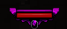
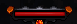
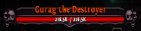

# Monsters

## Variants

| Enemy Type | Looks                                          | Base Stats                                                                           | Drop Rolls |
|------------|------------------------------------------------|--------------------------------------------------------------------------------------|------------|
| Normal     |                                                |                                                                                      | 1          |
| Superior   |                                                |                                                                                      | 2          |
| Elite      |                                                |                                                                                      | 4          |
| Champion   |  | +2 Monster Level, +300%/175%/150% Life (for Normal/Nightmare/Hell), +300% Experience | 4          |
| Ancient    |   | +4 Monster Level, +400%/300%/200% Life (for Normal/Nightmare/Hell), +500% Experience | 5          |
| Miniboss   |                                                |                                                                                      | 5          |
| Boss       |      |                                                                                      | 8          |

## Affixes
See [Hero Siege 2 Roadmap - Affixes](https://docs.google.com/spreadsheets/d/1QWjl6lITbMkjptYPIRwnIVUs7JQkqfEqAILlCgp1zAM/edit#gid=1151051678).