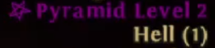
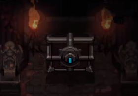
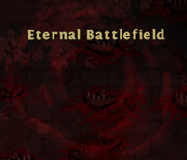
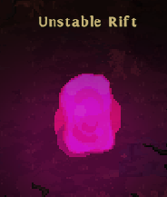
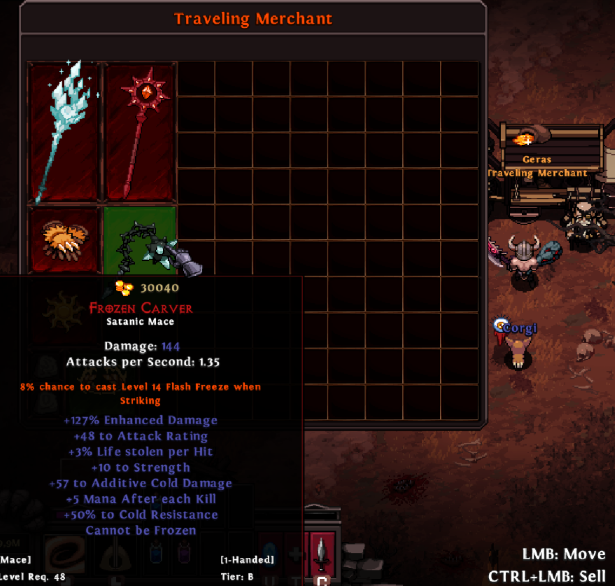

# Zone Events

## Satanic Zone
Satanic Zones increase the zone Level by 25, monster resistances by 5% and the chances of packs to spawn as champion by 75% and as Ancients by 50%. Satanic Zone also adds 150% hidden magic find to all kills done within the zone. They are only active on Hell and change the location every hour. Satanic Zones are indicated by a pentagram next to the zone name.

## Ambush
Ambush chests are a special type chests, which when opened, will release a group of monsters that surround and attack the hero. Only once the group of monsters has been defeated will the chest relinquish it's loot.

## Battlefield Portal
Once touched, Battlefield portals will expand and spawn a series of monsters. These monsters have a chance to drop Battle Fragments. At the end of the event it will turn into an "Eternal Battlefield" portal that acts as a boss dungeon for [War God Sung Lee](/instances/uber_bosses.html#war-god-sung-lee), which has an entry fee of 50 "Battle Fragments" per person.

## Unstable Rift Portal
Unstable Rift portals will teleport you to a new area where you will face a challenge of 5 monsters waves.

## Shadow Realm Portal
The Shadow Realm contains strong monsters and a merchant that's similar to the Traveling Merchant. It also allows you to challenge Uber Reaper for the cost of 10 Dimensional Shards.

## Traveling Merchant
The Traveling Merchant "Geras" offers satanics and runes for gold.

