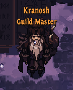

# Guilds
Guilds are formal groupings of players that enable them to play together more effectively and reward them for doing so. They are account wide, cross-regional and can hold up to 32 people. Odyssey players can be in Guilds as well, but they don't benefit from the guild perks. The guild menu can be accessed by pressing the "B" key.

## Creating a Guild
Guilds can be created for 5000g at "Kranosh" (Guild Master) in  "Danethorpe" (the town of Act 2). He can be found just southwest of the waypoint. 



Kranosh also allows you to change your Guild Name or Tag after the creation for a large gold fee.

## Progression
Guild XP, mentioned as GXP from this point onward, is gained when a Guild member earns regular experience. A portion of their personally gained XP (un-affected by EXP GAIN stat) transforms to GXP. This portion does **NOT** eat away the XP the player gains.

The base conversion % is 15%. (Note: This might change prior to launch)
Every extra player in the party, who is in the same guild, adds +2.5% extra GXP gain on top of the base value. Satanic Zones add yet another extra GXP gain of +6.66%. 

**Example:**

Player A, B and C are in the "MEOW" guild. They play with a third player, Player Z who belongs in "PEPEGA" guild. 
In this case, Players A and B gain the bonus of playing together. Player Z is the only representative of "PEPEGA" guild, his GXP gain gain stays at the base conversion rate.
```
15.00% + 2.50% = 20.0% for players A, B, C
15.00% + 0.00% = 15.0% for player Z
```

This means, with the example above, that if the players A, B and Z play in a satanic zone, their GXP gains would be:
```
20.00% + 6.66% = 26.66% for players A, B, C
15.00% + 6.66% = 21.66% for player Z
```

Players can also obtain Guild XP from Daily Guild Quests.

### Perks
Levelling a guild unlocks the following perks:
- Level 10: Unlock Daily Guild Quests
- Level 20: 1 Extra Quest to choose from
- Level 30: 10% Discount to Mercenary Hire
- Level 40: 10% Discount to Mercenary Resurrection
- Level 50: Unlock Guild Stash
- Level 60: Guild perk tier 1 (choose one)
    - 5% Magic Find Increase
    - 5% Movement Speed
- Level 70: Guild perk tier 1 (choose what's left)
- Level 80: Guild perk tier 2 (choose one)
    - 10% More gold from monster kills
    - 5% More selling value
- Level 90: Guild perk tier 2 (choose what's left)
- Level 100: Guild perk tier 3
    - 5% XP gain and extra tab in guild stash

There are also some visual upgrades at Level 55, 65, 75, 85 and 95. [^1]

----

[^1]: [HS Devlog - Under the Sea 3](https://panicartstudios.com/herosiege/?page=devlog)