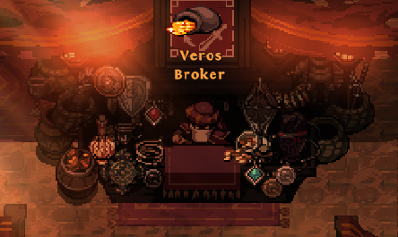

# Trading
## Market
The Tarethiel Market let's you buy or sell almost every item in the game. It can be found just north of the Village of Mos'Arathim (the town of Act 3). There is a listing fee of 1% and a transaction fee of 10%. Bought items will directly be added to your inventory. The gold from sold items will arrive via ingame mail.

**Notes:**
- Yes, it's normal that you don't see your own items on the buy tab of the market.
- If you want to list a stack of items, then the price you set is the total price and not the price per piece.
- The market is not available for Odyssey heroes

## Player To Player Trading
There is also the option to directly trade with other players (at your own risk!) in order to avoid fees. These trade listings can be found on the discord.